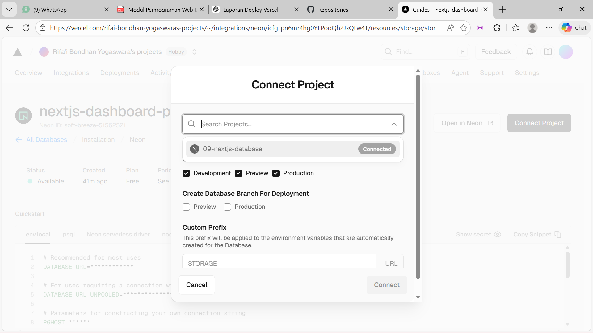
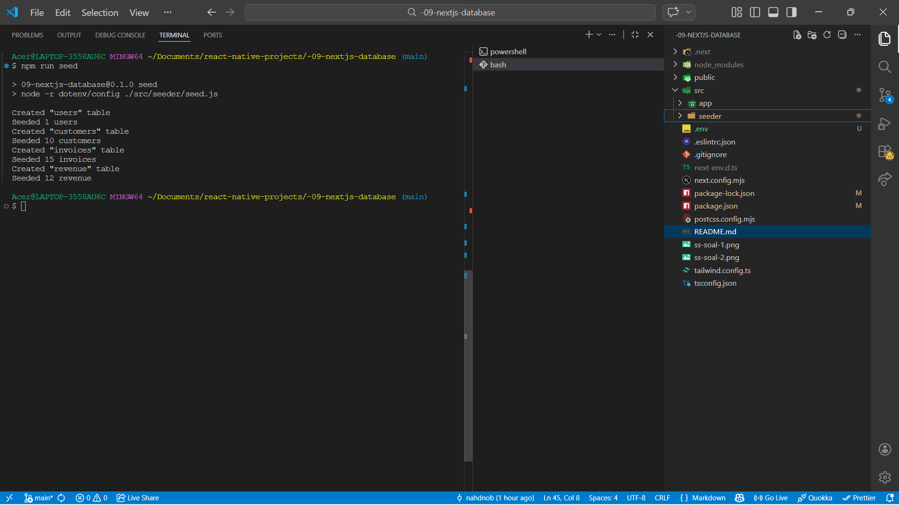
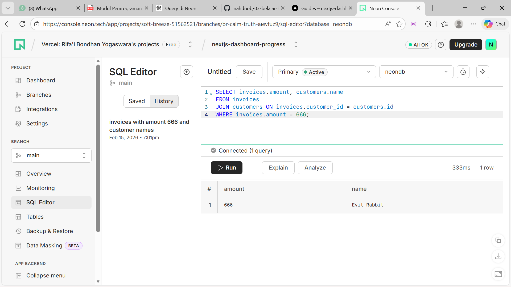
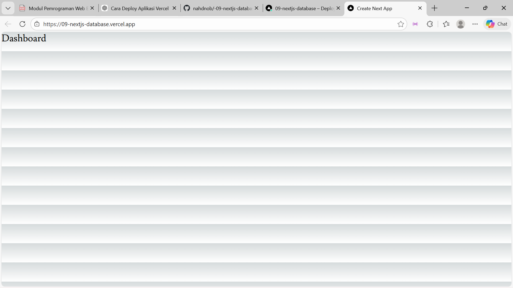
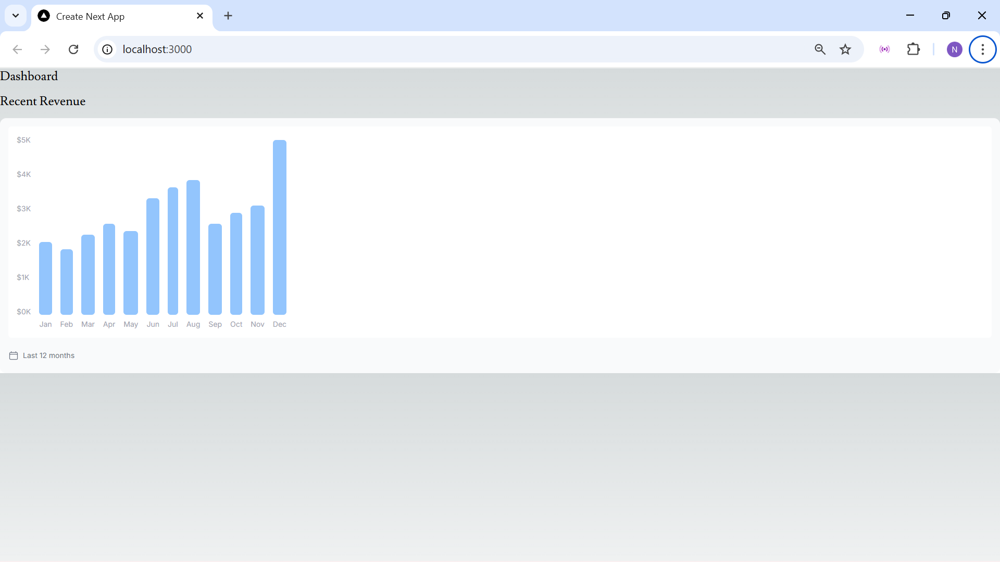

# W09 – Next.js Database & Deployment (Vercel)

## Hasil Tampilan
Berikut adalah hasil deploy aplikasi Next.js Database ke platform Vercel:

---

## Apa yang Saya Pelajari
Pada tugas ini saya mempelajari:

Soal 1:
    - Cara menggunakan starter code Next.js dari GitHub Template
    - Cara membuat repository baru menggunakan fitur **Use this template**
    - Cara menghubungkan akun GitHub dengan platform Vercel
    - Cara melakukan deployment aplikasi Next.js secara otomatis ke Vercel
    - Cara menjalankan Continuous Deployment dari GitHub ke Vercel
    - Cara mengelola project berbasis cloud tanpa konfigurasi server manual
    - Cara mengakses aplikasi yang telah di-deploy melalui URL publik
Soal 2:
    - Cara membuat basis data Postgres melalui **Vercel Marketplace**
    - Cara menghubungkan database Postgres dengan project Next.js
Soal 3:
    - Cara buat file env dengan "touch .env" karena setelah kita clone dari git
      file .env tidak ikut ter-clone
    - Cara konfigurasi POSTGRES_URL
Soal 4:
    - Cara query pada postgres
    - Memastikan data sudah ter-seed ke dalam database di postgres
Soal 5:
    - Cara melakukan deployment aplikasi ke Vercel dan memantau hasilnya melalui dashboard 
      Vercel.
    - Memahami konsep async component pada Next.js yang memungkinkan penggunaan sintaks 
      await untuk pengambilan data langsung di dalam komponen.
Soal 6:
    - Bagaimana menampilkan chart pada halaman dashboard
Soal 7:
    - Menampilkan 5 data yang telah disortir dari server, dan menambahkan gambar
      ke dalam file public/customers/ supaya gambar tersedia dan tampil

## Error yang Ditemui dan Solusinya
Selama pengerjaan tugas ini, terdapat beberapa kendala yang ditemui, antara lain:

Soal 1:
  ### 1. Project gagal deploy pada percobaan awal
  **Penyebab:**
  - Repository belum sepenuhnya tersinkron dengan Vercel
  
  **Solusi:**
  - Melakukan deploy ulang melalui dashboard Vercel
  - Memastikan branch utama (`main`) terpilih dengan benar
  
  ### 2. Repository tidak muncul saat impor ke Vercel
  **Penyebab:**
  - Akses GitHub ke Vercel belum diberikan
  
  **Solusi:**
  - Memberikan izin akses repository pada saat proses koneksi GitHub ke Vercel

Soal 2:
  **Penyebab:**
  - Pada modul dijelaskan bahwa database Postgres dibuat melalui menu Storage,
    namun pada versi terbaru Vercel menu tersebut sudah tidak tersedia.
  
  **Solusi:**
  - Database Postgres dibuat melalui menu **Marketplace** sesuai dengan
    pembaruan platform Vercel. Secara fungsi tetap sama dan terintegrasi
    langsung dengan project.

Soal 3:
  **Penyebab:**
  - Projek gagal saat menjalankan 'npm run seed', karena belum ada file .env
  
  **Solusi:**
  - buat file .env dan diisi dengan POSTGRES_URL yang diambil dari Vercel

Soal 6:
  **Penyebab:**
  - Tampilan chart berantakan

    **Solusi:**
  - Menyesuaikan className supaya tampilan lebih rapih dan mudah dibaca
